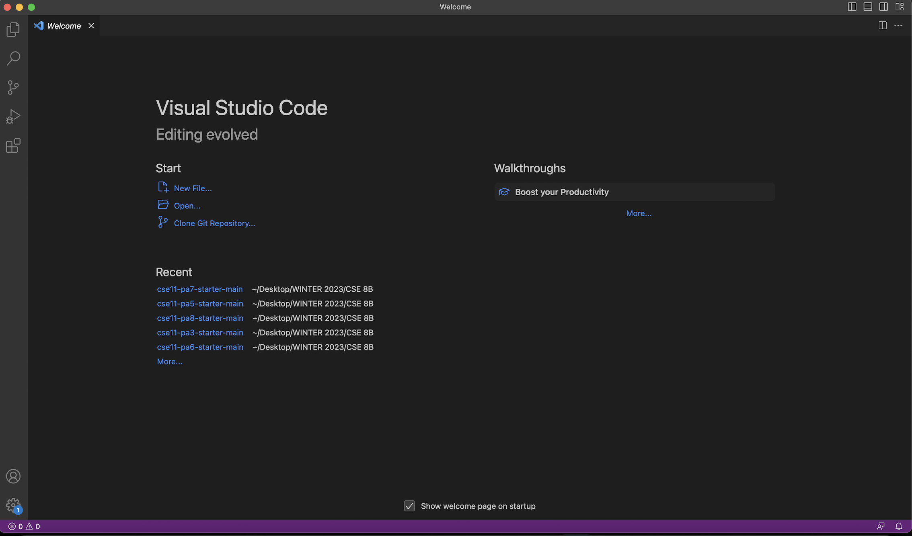
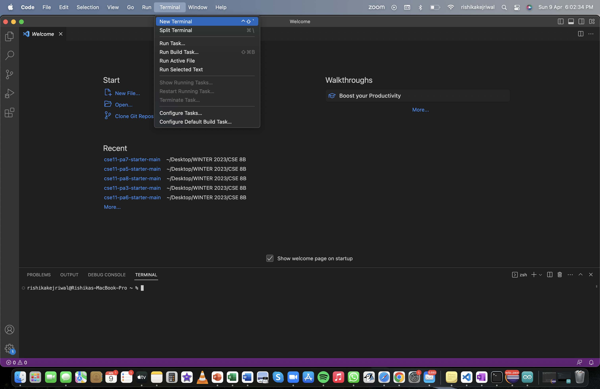
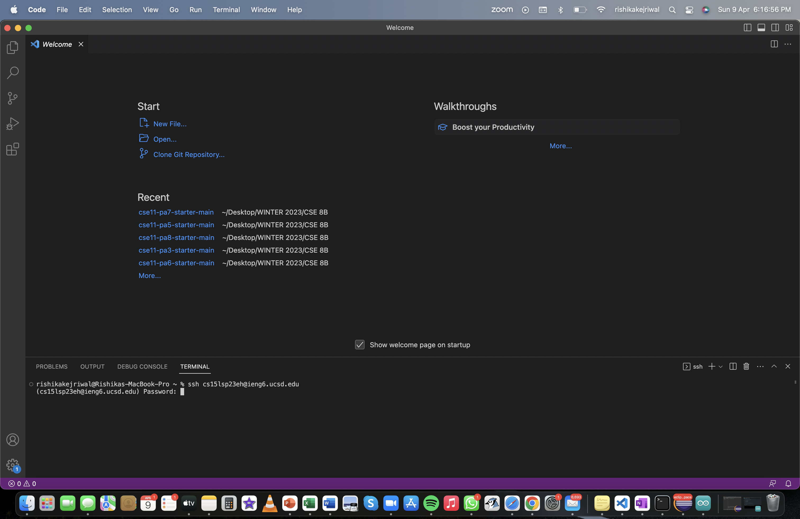
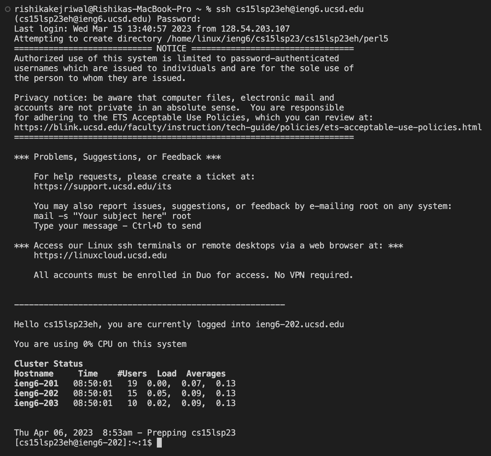
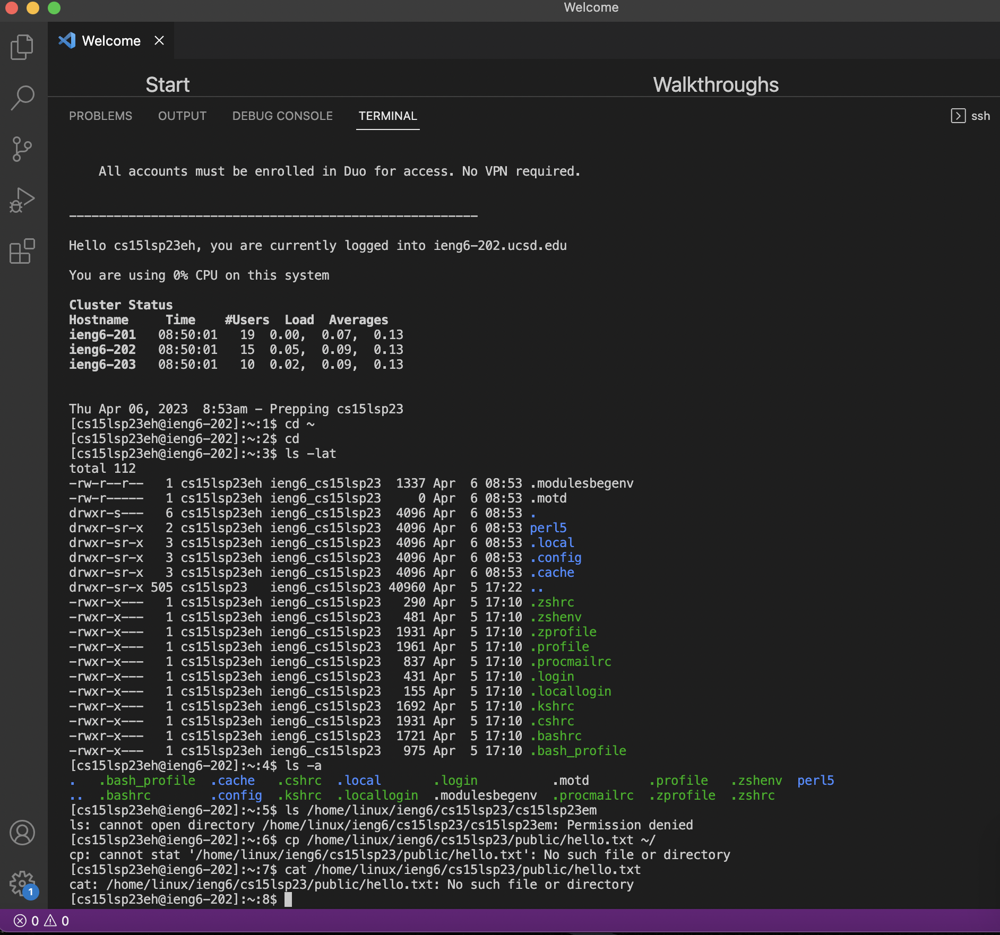

# Lab Report 1

To set-up for CSE 15L, you will have to go through the following three steps:

1. Downloading VScode
2. Remotely Connecting the terminal 
3. Trying some commands on VScode

## Downoading VScode

* To download VScode onto your respective devices, you can use the following website (link: [Link](https://code.visualstudio.com/)) for instructions! 
* The device I am using is a MacBook Pro with an M1 chip. For different operating systems, there will be different steps to follow so choose the ones that work for your device.
* Since I took CSE 8B the previous quarter, I already have VScode installed onto my device and therefore I skipped the first step of installation and continued from the second step. For those of you that have done the same (taken CSE 8B/ CSE 11) probably have VScode installed as well.
* Here's an example of how VScode should look like once you open it on your laptop!



* Now you are all set to move onto Step 2!

## Remotely Connecting

* To connect remotely, first you will have to open a new terminal in VScode. 


* After opening the terminal, type in the follwing to connect the terminal with your CSE 15L course specific account. Replace the zz here with the letters in **YOUR** course-specifc account. `$ ssh cs15lsp23zz@ieng6.ucsd.edu` 
* If this is the first time you have connected to the server, you will get a prompt as shown below to which you should respond 'Yes'. 
```
ssh cs15lsp23zz@ieng6.ucsd.edu
The authenticity of host 'ieng6.ucsd.edu (128.54.70.227)' can't be established.
RSA key fingerprint is SHA256:ksruYwhnYH+sySHnHAtLUHngrPEyZTDl/1x99wUQcec.
Are you sure you want to continue connecting (yes/no/[fingerprint])? 
```
* Since I have already connected to the server, my terminal appears like this. 


* Notice you are asked to input your passcode.
* You will now put in the passcode for your **course-specific** account to get connected to the server. 


* If your terminal now looks like the above, Congratulations! You are now connected to the server and can move onto Step 3.


## Trying Some Commands

* Now we should try using some commands in your terminal.
* Here are some commands you can try:
  - `cd ~`
  - `cd`
  - `ls -lat`
  - `ls -a`
  - `cp /home/linux/ieng6/cs15lsp23/public/hello.txt ~/` etc..

 * The commands I have tried using in my terminal are:
   - `cd ~`
   - `cd`
   - `ls -lat`
   - `ls -a`
   - `ls /home/linux/ieng6/cs15lsp23/cs15lsp23em` 
   - `cp /home/linux/ieng6/cs15lsp23/public/hello.txt ~/`
   - `cat /home/linux/ieng6/cs15lsp23/public/hello.txt` 
   
 
 
 * As you can see in the picture above, when I give `cd ~` and `cd` as commands, I do not get any output.
 * With the command `ls -lat` and `ls -a`, I get the green and blue coloured parts as the output.
 * In this command, `ls /home/linux/ieng6/cs15lsp23/cs15lsp23em` I am trying to connect the server with another of my group member's course-specific account. Therefore, the output I get is **Permission denied**.
 * For the last two commands, I am inputing the directory as files that do not exist. Therfore the output message is 'No such file or directory'.

Once you've completed all these steps, you are all set-up for CSE 15L! 
