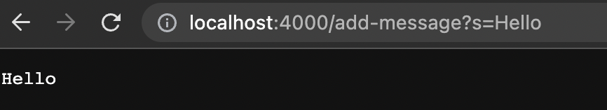
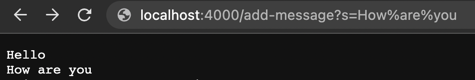

# Lab Report 2

This lab report will consist of three Parts:

1. Part 1 - StringServer
2. Part 2 - One bug from Lab 3
3. Part 3 - Learning from Labs in Week 2 or Week 3

## Part 1

* The following is the code for my `StringServer` and it is stored in the file called `StringServer.java`:


* The following two images are the usage of `/add-message`:



* The above `/add-message` is adding `Hello` to the server.



* Whereas the above `add-message` is adding another line after `Hello` to add `How are you` to the server which results in the following output on the server.
```
Hello
How are you
``` 
* The methods called in my code are `handleRequest` in the class `Handler` and the method `main` in the class `StringServer`.

* The relevant arguments to the method `handleRequest` are the fields `temp` which has `String` datatype and `parameters` which has `String[]` datatype i.e. String Array.
    - The field `parameters` splits the query after the `=` sign to understand what the argument is and then stores its value in `temp`.
    - The field `temp` is first initialized to `""` and then after the argument is split and passes the if statements, the value of `temp` is intialized to the value that will be given after `/add-message`.
   
* The value of the field `temp` changes from the specific request of `/add-message`. This is because each time we add a new message to the server, its value gets stored in the field `temp`. Therefore, with the first `/add-message` request, the value `Hello` gets stored in the field `temp` and then with the second `/add-message` request, the new value gets stored in the field `temp` which will print the new message on the line right after the first message, as it can be seen in the second screenshot. This change is taking place by the usage of if statements which checks the value of `temp` and accrodingly gives the desired output.

## Part 2

* One bug from Lab 3 that I will be addressing in this report is the error in the method _**reversed**_ in the file `ArrayExamples.java`.
* A failure-inducing input for the buggy program, is writing a test case such as:
```
@Test
public void testReversed1() {
  int[] input1 = {1,2,3};
  assertArrayEquals(new int[]{3,2,1}, ArrayExamples.reversed(input1));
}
```
  -  The above test case will cause a failure in the code as it gives us the wrong output. To understand the cause and symptoms of this test case, we can look at the next few bullet points in Part 2.

* An input that doesn’t induce a failure, is writing a test case such as:
```
@Test
public void testReversed() {
  int[] input1 = { };
  assertArrayEquals(new int[]{ }, ArrayExamples.reversed(input1));
}
```
  - This test case did not cause a failure because the array is empty. Therefore, it doesn't have to interate through any values in the array and gives an output of an empty array which matches up with the expected output. Thus, even with the bug, this test case works.

* The symptom, as the output of running these tests is the following:


  - At the very bottom of this image we see that the terminal ran 4 test cases out of which one of them failed. To figure out which test case in particular failed, we will look at the line below, `There was 1 failure:` which tells us that `testReversed1` failed. It also tells us why this test case failed. Thus by looking at the image above we can figure out that the test failed because the expected value at index 0 should be 3 but the actual value was 0. I have now attempted at fixing this bug in the next bullet point.

* The bug, as the before-and-after code change required to fix it is the following:

    **BEFORE :**
```
static int[] reversed(int[] arr) {
  int[] newArray = new int[arr.length];
  for(int i = 0; i < arr.length; i += 1) {
    arr[i] = newArray[arr.length - i - 1];
  }
  return arr;
}
```
  - The before code is assigning new values to the array `arr` in the for loop instead of the newArray and is also returning arr back instead of `newArray`. This causes an error in `testReversed1` as the expected output and the actual output do not match. This buggy code is essentially assigning new values to arr which already has elements inside it due to which it is returning an array with all the values as 0. This can also be inferred from the image I have provided in the previous bullet point. Thus to fix this bug we should do it in the follwing manner:

    **AFTER :**
    
```
static int[] reversed(int[] arr) {
  int[] newArray = new int[arr.length];
  for(int i = 0; i < arr.length; i += 1) {
    newArray[arr.length - i - 1] = arr[i];
  }
  return newArray;
}
```
  - The after code is now giving the correct output and working because now, the for loop is iterating through the array `arr` to assign new values to the array `newArray`. I have also corrected the return value to now be `newArray` because we want the `newArray` to give us the reversed value for `arr`. Thus, the actual and expected output now match and the bug has been removed by these fixes.

## Part 3

* In the labs conducted in weeks 2 and 3, I learnt how to use GitHub Desktop to clone a repository and open it in VScode. 
* Since, I had never worked with GitHub before, it was my first time using GitHub Desktop as well which was an interesting experience for me.
* By opening these repositories in VScode I was able to learn how to create servers and get them to return messages, this was also something I had never done before and I was intrigued to learn more about it.
* I also learnt that we can add paths to servers which can count, increment and add values and then return them by using `String.format`.
* Discovering new tools, paths and methods was an enjoyable learning experience for me.
