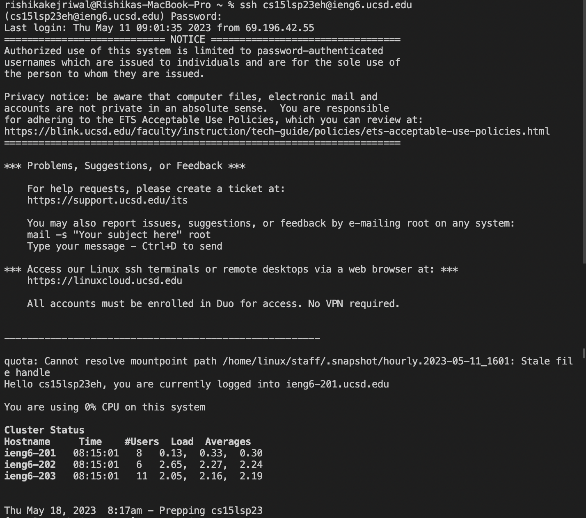
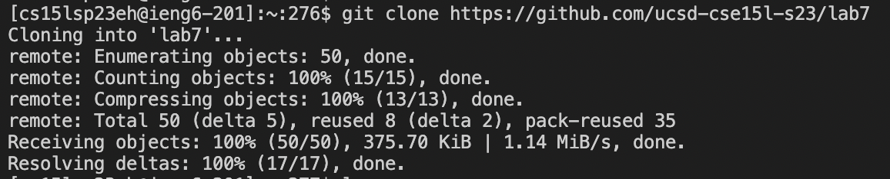
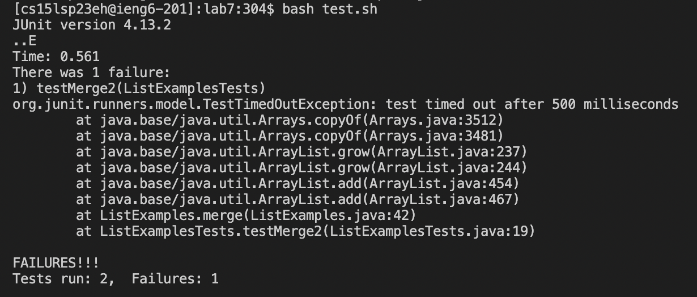
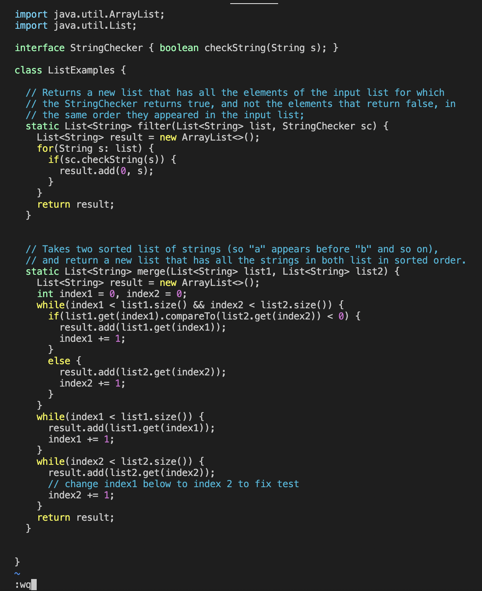
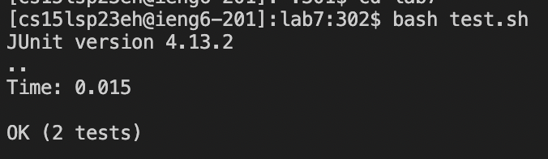
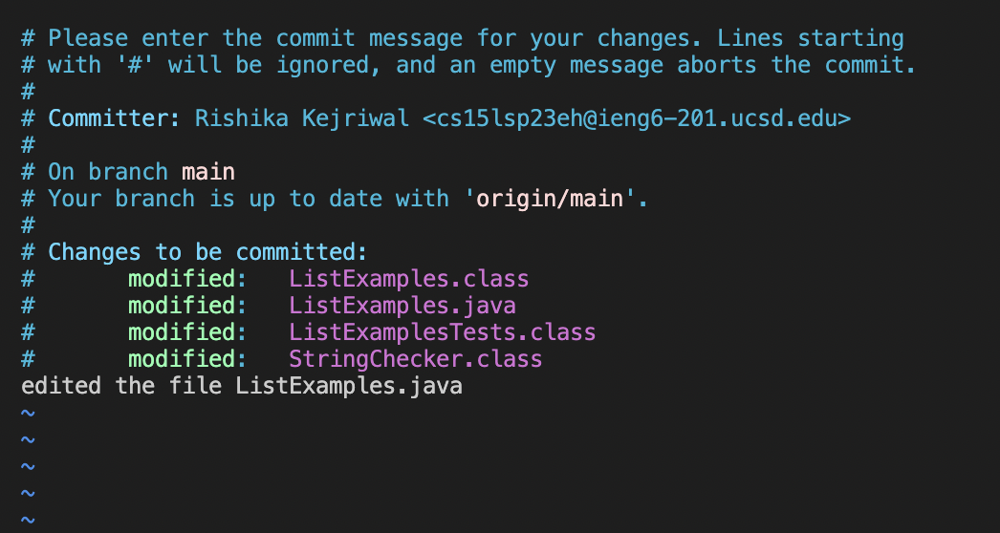
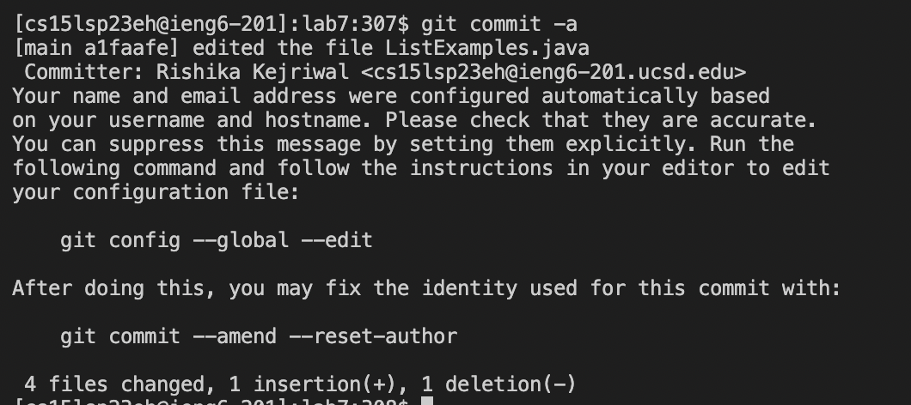
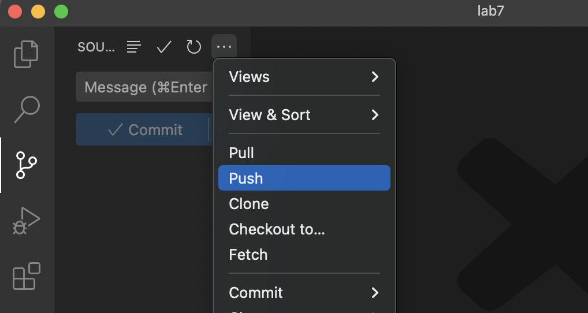

# Lab Report 4

This Lab Report consists of 6 steps that is from Step 4 to Step 9.

## Step 4 - Log into ieng6

Keys pressed: `ssh cs15lsp23eh@ieng6.ucsd.edu <enter>` and `Password: <enter>` By this I successfully logged into my ieng6 account. These commands are accessing my CSE 15L course specific account and then asking me for my password to help me log into my account.

## Step 5 - Clone your fork of the repository from your Github account

Keys pressed: `git clone https://github.com/ucsd-cse15l-s23/lab7 <enter>` By putting in the `git clone` command I am able to clone any repository I have forked. Therefore, after putting in the `git clone` command I put in the url of the repository I want to clone, and it gets cloned onto my device. I can then press `cd lab7` to change the current directory to `lab7` so that I can access all the files inside that directory.

## Step 6 - Run the tests, demonstrating that they fail

Keys pressed: `bash test.sh <enter>` By pressing this command, we know that the terminal ran 2 tests and one of them failed. We can see this failure in the image above is caused in `ListExamples.java` at line 42 and therefore we will have to fix the method at that line. We can fix this error by opening the file in `vim` and then modify it.

## Step 7 - Edit the code file to fix the failing test

Keys pressed: 
1. `vim ListExamples.java` The command `vim` lets me modify the file `ListExamples.java` and correct the errors. Now, by using `vim` commands I will be correcting line 44 where the error is caused, that is instead of `index1` it should be corrected to `index2`.
2. `:44 <enter>` This `vim` command takes my cursor to line 44 where the error is present.
3. `<l><l><l><l><l>` By pressing `l` 5 times, I am able to move my cursor to the right 5 times so that I am on the `1` in `index1` on line 44.
4. `<x>` This command will remove `1` from `index1`.
5. `<i>` This command enters insert mode and will help me insert a character at the place where my cursor is which is after `x` in `index`.
6. `2 <esc>` By this I am inserting `2` after `index` which makes it `index2` and then I am pressing `<esc>` to exit from the insert mode back to normal mode.
7. `:wq` By pressing this last command, I am able to save the changes I made and quit out of `vim` back to my terminal. `w` saves the changes and `q` quits from `vim`.

## Step 8 - Run the tests, demonstrating that they now succeed

Keys pressed: `<up><up> <enter>` The command `bash test.sh` was 2 up in the command history so by pressing the up arrow 2 times I was able to access it and use it. When we run `bash test.sh` again we can now see in the image above that the terminal ran two tests and they both passed. Hence, our fix in the code worked and the tests ran.

## Step 9 - Commit and push the resulting change to your Github account 

Keys pressed: `git commit -a <enter>` By pressing the following I was able to commit my changes and insert the commit message of `edited the file ListExamples.java` by pressing the keys `<i> edited the file ListExamples.java <esc> :wq`. The key `<i>` inserted the commit message and `:wq` saved the change and quit `vim`. After quitting `vim` the follwoing appeared in my terminal.

After receieving this in the terminal, I pushed my work to GitHub as shown in the image below.

