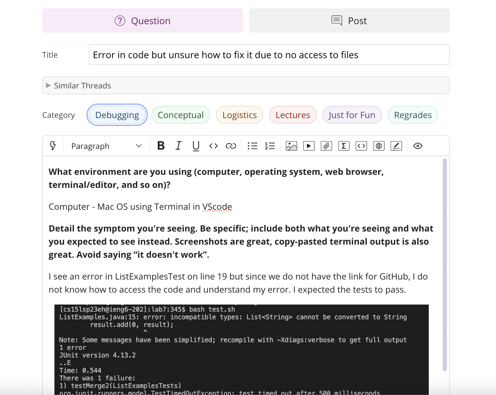
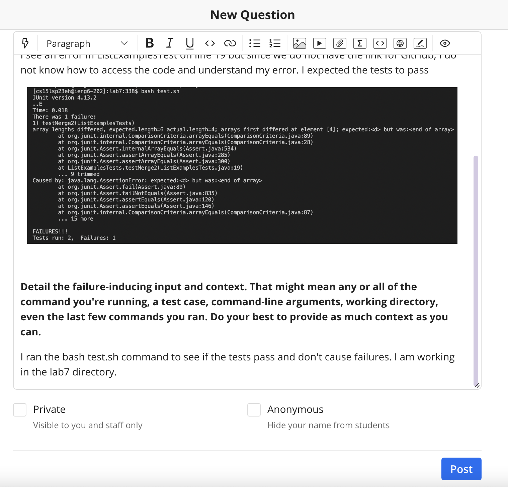
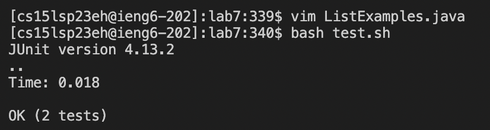
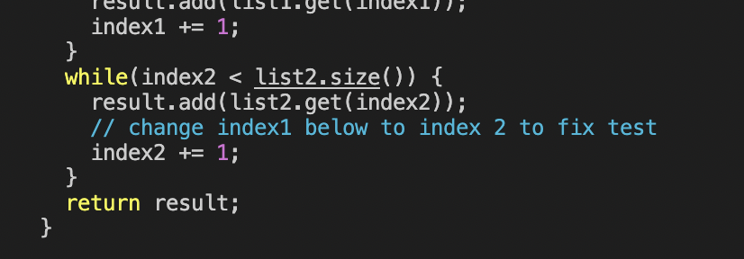
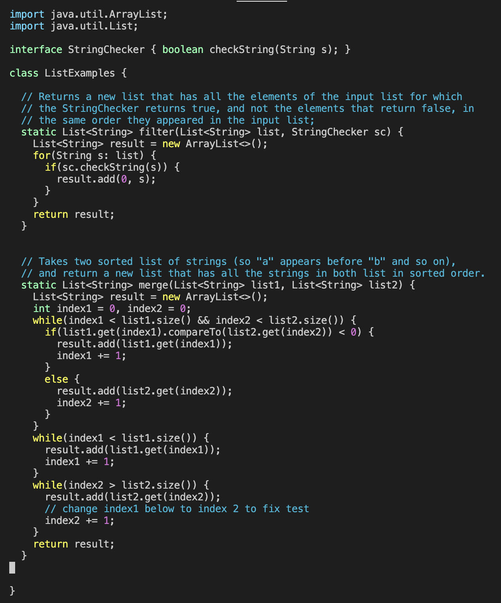
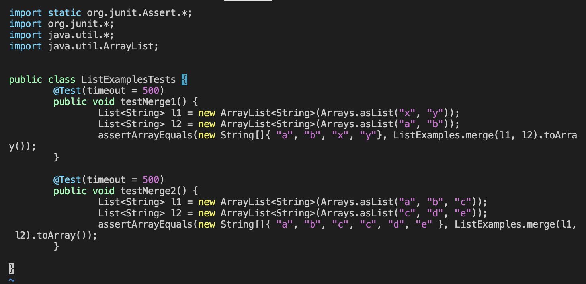

# Lab Report 5

This Lab Report consists of two parts:
1. Part 1 - Debugging Scenario
2. Part 2 - Reflection

## Part 1 - Debugging Scenario

### 1. Post from student on edstem about bug in the code

* Here the student is asking the TA about an error caused by the code due to some bug in it. However, they cannot understand what the bug is and how they should go about fixing it. They have also incorrectly indentified the file in which the bug is present.

### 2. Response from TA 
Revisit the commands we learnt in lecture. You can use `vim` to access the files without having it on GitHub to view. Also, the error is caused in the file `ListExamples.java` and not `ListExamplesTests.java` as I can see in the picture you have provided. I suggest you use the `vim ListExamples.java` command to access the contents of the file and then work of fixing the error in your code. It seems that there is a `ComparisonCriteria` error. I suggest you check your code and fix the comparisons you are making in the if and while statements.

### 3. Terminal Output after receiving feedback from TA
**Terminal output:** 

**Correction in file:** 

* The student opened the file `ListExamples.java` using `vim` as the TA suggested and checked their code and found an error in the while loop where they had incorrectly comapred `index2` and `list2.size` in line 41. 
* This was the incorrect command given: `index2 > list2.size()`
* After the feedback from the TA, the student changed it to the correct comparison: `index2 < list2.size()`
* The student then ran the tests using `bash test.sh` and did not get any failures.
* Thus, the student fixed the bug and their tests run now.

### 4. Information about setup
1. File and Directory Structure: The files are from the GitHub repository for Lab7. After cloning the repository, we change the current directory to lab7 by using the command `cd lab7`. We can then use `ls` to see all the files present in the directory. Here the files present are: `ListExamples.class  ListExamplesTests.class  StringChecker.class  test.sh ListExamples.java   ListExamplesTests.java   lib`

2. Contents of each file before fixing the bug:

ListExamples.java:

ListExamplesTests.java:

3. Command line ran to trigger the bug: `bash test.sh`

4. Edit to fix bug: Change `index2 > list2.size()` on line 41 in `ListExamples.java` to `index2 < list2.size()`

## Part 2 - Reflection

One cool thing I learnt in Lab in the second half of the quarter was the command `vim`. I found it really interesting and easy to use as it can provide so much information inside a file if you don't have direct access to it. This is why I have used it in my Lab Report 5 as well. Another interesting concept was learning how TA's grade our assignments using grade.sh. Knowing the behind the scenes of grading an assignment was nice to learn about and a new experience that you don't get in other CS classes.
