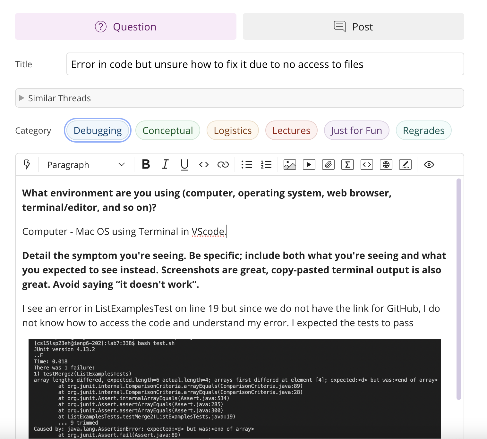

# Lab Report 5

This Lab Report consists of two parts:
1. Part 1 - Debugging Scenario
2. Part 2 - Reflection

## Part 1 - Debugging Scenario

### 1. Post from student on edstem about bug in the code

* Here the student is asking the TA about an error caused by the code due to some bug in it. However, they cannot understand what the bug is and how they should go about fixing it.

### 2. Response from TA 
* Revisit the commands we learnt in lecture. You can use `vim` to access the files without having it on GitHub to view. 
* Also, the error is caused in the file `ListExamples.java` and not `ListExamplesTests.java`.
* I suggest you use the `vim ListExamples.java` command to access the contents of the file and then work of fixing the error in your code. 
* As I can see in the picture you have provided, there seems to be an error in `result.add(0, result)`. Check your code and fix the incompatible datatypes error.

## Part 2 - Reflection
